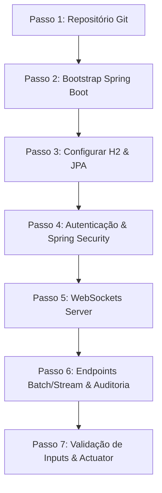

# Guia Técnico Detalhado - Membro A (Infraestrutura, BD, Segurança e APIs)
**Projeto:** Innovation Lab Management  
**Autor:** Membro A (Foco em Backend, Persistência, Segurança e Integração)

Este documento descreve detalhadamente o que precisas de implementar e a sequência passo a passo para construir a infraestrutura do backend do vosso projeto.

---

## Sequência Geral de Implementação (Timeline do Membro A)



---

## PASSO 1: Inicialização do Repositório Git (Dia 1)
Como és o responsável pela infraestrutura, deves criar o repositório central.

1. **Criar o repositório local:** Na pasta raiz do projeto, corre no terminal:
   ```bash
   git init
   ```
2. **Criar o ficheiro `.gitignore`:** Essencial para não subir ficheiros da IDE (Eclipse/IntelliJ) ou compilados. Cria um `.gitignore` na raiz com:
   ```text
   target/
   *.class
   .mtj.tmp/
   *.jar
   *.war
   *.ear
   *.db
   .idea/
   *.iml
   .classpath
   .project
   .settings/
   bin/
   /data/
   ```
3. **Fazer o commit inicial:**
   ```bash
   git add .
   ```
   *Nota: Cria o repositório no GitHub/GitLab do grupo, adiciona o link remoto e faz push da branch `main`.*
   ```bash
   git remote add origin <URL-REPOSITORIO>
   git branch -M main
   git push -u origin main
   ```

---

## PASSO 2: Criar o Esqueleto do Spring Boot (Dia 1-2)
Acede ao [Spring Initializr (start.spring.io)](https://start.spring.io) e gera o projeto com as seguintes definições:

1. **Project:** Maven
2. **Language:** Java (versão 17 ou superior)
3. **Spring Boot:** 3.x.x (última versão estável)
4. **Group:** `com.acertarorumo`
5. **Artifact:** `innovationlab`
6. **Dependencies (Adicionar no painel direito):**
   * *Spring Web* (Criação de REST APIs)
   * *Spring Data JPA* (Persistência SQL/Hibernate)
   * *H2 Database* (Base de dados embebida)
   * *Spring Security* (Autenticação, autorização e encriptação)
   * *Lombok* (Opcional, reduz getters/setters/construtores)
   * *Spring Boot Actuator* (Métricas e Health Checks)
   * *WebSocket* (Comunicação real-time)
   * *Validation* (Para validar dados das requisições REST com `@NotNull`, `@Size`, etc.)
7. **Descarregar e Importar:** Clica em **Generate**, extrai o `.zip` na pasta do repositório Git e importa na tua IDE de preferência.

---

## PASSO 3: Configurar a Base de Dados H2 & JPA (Dia 2)
O enunciado e o documento de dúvidas pedem o **H2/SQLite** como BD definitiva, persistindo em disco para não se perderem dados ao reiniciar o servidor.

No ficheiro `src/main/resources/application.properties`, deves colocar a seguinte configuração:

```properties
# Porto da Aplicação
server.port=8080

# Configuração da Base de Dados H2 persistida em ficheiro local (.db na raiz do projeto)
spring.datasource.url=jdbc:h2:file:./data/innovationlab;DB_CLOSE_DELAY=-1;DB_CLOSE_ON_EXIT=FALSE
spring.datasource.driverClassName=org.h2.Driver
spring.datasource.username=sa
spring.datasource.password=password

# Ativar a consola web do H2 para poderes visualizar as tabelas no browser
spring.h2.console.enabled=true
spring.h2.console.path=/h2-console
# Nota: o Spring Security irá bloquear o acesso à consola por padrão, configuramos isso no Passo 4.

# Configuração do Hibernate / JPA
spring.jpa.database-platform=org.hibernate.dialect.H2Dialect
spring.jpa.hibernate.ddl-auto=update
spring.jpa.show-sql=true
spring.jpa.properties.hibernate.format_sql=true
```

---

## PASSO 4: Autenticação, Sessão & Segurança (Fase 2 - 30 Maio a 10 Junho)
Esta é a tua tarefa mais complexa da Fase 2. Vais implementar o controlo de acessos no servidor.

### 4.1 Configurar Spring Security (Sessão Tradicional)
O enunciado exige controlo de sessão no servidor. Em vez de JWT (tokens no cliente), usaremos a sessão clássica do Spring Security (`JSESSIONID` em Cookie).

Cria uma classe de configuração `SecurityConfig.java` no pacote `config`:

```java
package com.acertarorumo.innovationlab.config;

import org.springframework.context.annotation.Bean;
import org.springframework.context.annotation.Configuration;
import org.springframework.security.config.annotation.method.configuration.EnableMethodSecurity;
import org.springframework.security.config.annotation.web.builders.HttpSecurity;
import org.springframework.security.config.annotation.web.configuration.EnableWebSecurity;
import org.springframework.security.crypto.bcrypt.BCryptPasswordEncoder;
import org.springframework.security.crypto.password.PasswordEncoder;
import org.springframework.security.web.SecurityFilterChain;

@Configuration
@EnableWebSecurity
@EnableMethodSecurity // Permite usar @PreAuthorize nos Controllers
public class SecurityConfig {

    @Bean
    public PasswordEncoder passwordEncoder() {
        // Encriptação robusta para passwords (Requisito 8.3)
        return new BCryptPasswordEncoder();
    }

    @Bean
    public SecurityFilterChain filterChain(HttpSecurity http) throws Exception {
        http
            .csrf(csrf -> csrf.disable()) // Desativar para facilitar desenvolvimento de API REST
            .authorizeHttpRequests(auth -> auth
                // Endpoints públicos (Registo, Confirmação de e-mail, Login)
                .requestMatchers("/api/auth/register", "/api/auth/login", "/api/auth/confirm-email", "/api/auth/reset-password").permitAll()
                // Permitir consola H2 em desenvolvimento
                .requestMatchers("/h2-console/**").permitAll()
                // Qualquer outro pedido exige autenticação
                .anyRequest().authenticated()
            )
            // Permitir abrir frames (necessário para a consola H2)
            .headers(headers -> headers.frameOptions(frame -> frame.sameOrigin()))
            // Gerenciamento de sessão
            .sessionManagement(session -> session
                .maximumSessions(1) // Apenas 1 sessão ativa por utilizador
            );

        return http.build();
    }
}
```

### 4.2 Configurar o Session Timeout
No ficheiro `application.properties`, define o tempo de expiração de inatividade (ex: 15 minutos, Requisito 8.1):
```properties
server.servlet.session.timeout=15m
```

### 4.3 Algoritmo de Hashing e Força das Passwords
* **Força das Passwords (Requisito 8.2):** No serviço de registo de utilizadores, deves implementar uma validação regex antes de salvar na BD. Exemplo de regras recomendadas: mínimo 8 caracteres, 1 número, 1 letra maiúscula, 1 minúscula e 1 caractere especial.
* **Hashing (Requisito 8.3):** No teu `AuthService`, antes de guardar o utilizador na BD, encriptas a password:
  ```java
  String passwordEncriptada = passwordEncoder.encode(userDto.getPassword());
  user.setPassword(passwordEncriptada);
  ```

---

## PASSO 5: WebSocket Server Setup (Fase 3 - 11 a 20 de Junho)
Para enviar as leituras fisiológicas em tempo real para a representação do Corpo Humano 2D no Frontend, tens de expor o WebSocket no Spring.

Cria a classe `WebSocketConfig.java` no pacote `config`:

```java
package com.acertarorumo.innovationlab.config;

import org.springframework.context.annotation.Bean;
import org.springframework.context.annotation.Configuration;
import org.springframework.messaging.simp.config.MessageBrokerRegistry;
import org.springframework.web.socket.config.annotation.EnableWebSocketMessageBroker;
import org.springframework.web.socket.config.annotation.StompEndpointRegistry;
import org.springframework.web.socket.config.annotation.WebSocketMessageBrokerConfigurer;

@Configuration
@EnableWebSocketMessageBroker
public class WebSocketConfig implements WebSocketMessageBrokerConfigurer {

    @Override
    public void configureMessageBroker(MessageBrokerRegistry config) {
        // Ativa um broker simples na memória para enviar dados aos subscritores
        config.enableSimpleBroker("/topic");
        // Prefixo para mensagens enviadas do cliente para o servidor
        config.setApplicationDestinationPrefixes("/app");
    }

    @Override
    public void registerStompEndpoints(StompEndpointRegistry registry) {
        // Endpoint que o frontend React vai conectar
        registry.addEndpoint("/ws-simulacao")
                .setAllowedOrigins("http://localhost:3000") // URL padrão do React
                .withSockJS(); // Fallback para browsers antigos
    }
}
```

---

## PASSO 6: Endpoints Batch/Stream & Auditoria de Base de Dados (Fase 4 - 21 a 28 de Junho)

### 6.1 Auditoria Automática (Requisito 8.6 / Dúvidas PDF pg. 6)
O cliente exige colunas de auditoria nas tabelas. O JPA faz isto de forma automática com a anotação `@EntityListeners(AuditingEntityListener.class)`.

1. Adiciona a anotação `@EnableJpaAuditing` na tua classe principal do Spring Boot (`InnovationLabApplication.java`).
2. Cria uma classe abstrata `Auditable.java` que todas as tuas entidades (User, Alerta, etc.) vão estender:

```java
package com.acertarorumo.innovationlab.model;

import jakarta.persistence.*;
import org.springframework.data.annotation.CreatedBy;
import org.springframework.data.annotation.CreatedDate;
import org.springframework.data.annotation.LastModifiedBy;
import org.springframework.data.annotation.LastModifiedDate;
import org.springframework.data.jpa.domain.support.AuditingEntityListener;
import java.time.LocalDateTime;

@MappedSuperclass
@EntityListeners(AuditingEntityListener.class)
public abstract class Auditable {

    @CreatedDate
    @Column(name = "created_date", updatable = false)
    private LocalDateTime createdDate;

    @LastModifiedDate
    @Column(name = "last_modified_date")
    private LocalDateTime lastModifiedDate;

    @CreatedBy
    @Column(name = "created_by", updatable = false)
    private String createdBy;

    @LastModifiedBy
    @Column(name = "last_modified_by")
    private String lastModifiedBy;
    
    // Opcional: adicionar o IP da última alteração no serviço
}
```

### 6.2 Endpoints REST para Leituras Fisiológicas (Requisito 5.4)
* **Batch (5.4.1):** Endpoint que aceita um array de leituras (JSON) ou upload de ficheiro CSV.
  * `POST /api/leituras/batch`
* **Stream (5.4.2):** Endpoint que recebe leituras individuais de forma incremental.
  * `POST /api/leituras/stream`
  * Deves chamar a WebSocket Template (`SimpMessagingTemplate`) para publicar cada leitura recebida para a rota do WebSocket em tempo real.

---

## PASSO 7: Validação de Inputs, Actuator & Qualidade (Fase 5 - 29 Junho a 3 Julho)

### 7.1 Validação de Inputs (Prevenção XSS / SQL Injection - Requisito 8.5)
* Usa anotações do Bean Validation nos DTOs que recebem dados do Frontend.
```java
public class RegistoRequest {
    @NotBlank(message = "O email é obrigatório")
    @Email(message = "Email inválido")
    private String email;

    @Size(min = 8, message = "A password deve ter pelo menos 8 caracteres")
    private String password;
}
```
* Adiciona `@Valid` nos parâmetros do teu Controller:
```java
@PostMapping("/register")
public ResponseEntity<?> registar(@Valid @RequestBody RegistoRequest request) { ... }
```

### 7.2 Health Checks (Actuator - Requisito 8.7)
* Como adicionaste o Starter Actuator no passo 2, podes testar a saúde da aplicação (incluindo o estado da BD H2 e espaço em disco) acedendo a:
  * `GET http://localhost:8080/actuator/health`
* Para expor mais detalhes do actuator, adiciona no `application.properties`:
  ```properties
  management.endpoints.web.exposure.include=health,metrics
  management.endpoint.health.show-details=always
  ```

---

## checklist Prático de Arranque Rápido para o Membro A

- [ ] Executar `git init` na pasta do projeto e subir a branch `main`.
- [ ] Configurar o `.gitignore` na raiz para não misturar ficheiros de compilação.
- [ ] Gerar o projeto no [Spring Initializr](https://start.spring.io) com Java 17+, Maven e as dependências: Web, Security, JPA, H2, Actuator, WebSocket, Validation e Lombok.
- [ ] Extrair o projeto no repositório e testar se compila correndo `./mvnw clean compile` no terminal.
- [ ] Adicionar as configurações do H2 persistente no `application.properties`.
- [ ] Correr a classe principal do Spring Boot e aceder a `http://localhost:8080/h2-console` para testar se a BD em disco funciona.
