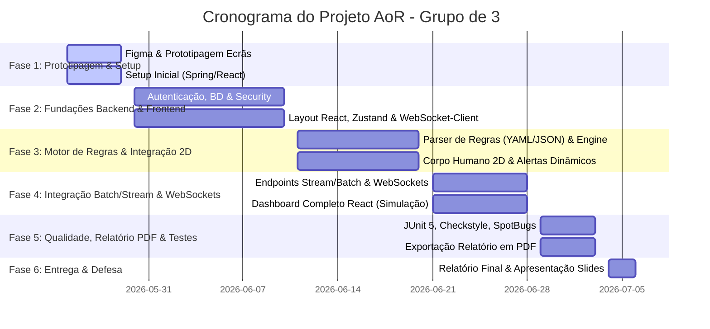

# Plano de Trabalho e Distribuição de Tarefas (Roadmap)
**Projeto:** Innovation Lab Management (Projeto AoR - 12ª Edição)  
**Período:** 25 de Maio a 6 de Julho de 2026 (6 Semanas)  
**Grupo:** 3 Elementos

---

## 1. Definição de Papéis no Grupo

Para garantir que o trabalho flui sem gargalos e que a divisão é justa, propomos 3 papéis principais. No entanto, todos devem colaborar na integração e testes:

* **Membro A (Backend & Infraestrutura):**
  * Responsável pela configuração do Spring Boot, Segurança, BD H2, Persistência JPA, Autenticação, Perfis de Acesso e Auditoria.
* **Membro B (Lógica de Negócio, Motor de Regras & Relatórios):**
  * Responsável pelo processamento de simulações (Batch/Stream), parser de YAML/JSON (miniDSL), motor de regras, geração de relatórios PDF/Online e testes unitários JUnit 5.
* **Membro C (Frontend & UI/UX):**
  * Responsável pelo desenvolvimento em ReactJS + Zustand, prototipagem em Figma, representação visual 2D do corpo humano, dashboards com gráficos em tempo real e consumo de WebSockets.

---

## 2. Cronograma Geral (Milestones)

---

## 3. Detalhe das Fases e Distribuição de Tarefas

### Fase 1: Prototipagem Rápida & Setup Inicial (25 a 29 de Maio)
*Foco: Apresentar a prototipagem dos ecrãs ao cliente (27-29 de maio) e deixar a estrutura base pronta.*
* **Membro C:** Desenhar protótipo rápido no Figma dos ecrãs principais (Login, Dashboard de Simulação, Listagem de Alertas, Gestão de Regras pelo Gestor, Relatório).
* **Membro A:** Inicializar repositório Git, criar esqueleto do Spring Boot (Spring Initializr), configurar base de dados H2.
* **Membro B:** Definir as entidades de domínio JPA (`User`, `Alerta`, `Leitura`, `Regra`) no Spring e criar o diagrama de classes inicial.

### Fase 2: Fundações (30 de Maio a 10 de Junho)
*Foco: Autenticação, Perfis de Utilizador e Interface Base.*
* **Membro A (Backend):**
  * Configurar **Spring Security** para autenticação baseada em sessão.
  * Implementar Registo (com envio simulado de link de ativação por e-mail) e Login.
  * Hashing de passwords com BCrypt e validação de força de password.
* **Membro B (Backend):**
  * Desenvolver a gestão de utilizadores (Administrador pode atribuir perfis A, B, C e fazer Soft Delete).
  * Criar os serviços de persistência básicos e tratamento global de exceções.
* **Membro C (Frontend):**
  * Setup do projeto ReactJS + Zustand.
  * Implementar ecrãs de Login, Registo e Recuperação de Password.
  * Criar a estrutura de rotas protegidas por tipo de utilizador no React.

### Fase 3: Motor de Regras & Representação 2D (11 a 20 de Junho)
*Foco: Lógica de negócio profunda e visualização interativa do corpo humano.*
* **Membro B (Backend):**
  * Implementar o parser para as regras em YAML/JSON (miniDSL) (ex: `hr > 120 for 2m`).
  * Criar o serviço que avalia as leituras fisiológicas recebidas e despoleta Alertas com base nas regras ativas.
* **Membro A (Backend):**
  * Configurar o servidor de WebSockets no Spring Boot para enviar eventos em tempo real.
  * Implementar persistência dos Alertas gerados e o histórico.
* **Membro C (Frontend):**
  * Desenhar/implementar o **Corpo Humano 2D** em React (pode ser SVG interativo ou componentes CSS dinâmicos) destacando os sistemas (cardiovascular, respiratório, etc.) nas cores Neutro, Amarelo e Vermelho.
  * Ligar o cliente WebSocket do React para receber atualizações do backend e atualizar o corpo humano 2D dinamicamente.

### Fase 4: Integração de Leituras & Dashboard (21 a 28 de Junho)
*Foco: Consumo de dados Batch/Stream e Dashboard do Gestor.*
* **Membro A (Backend):**
  * Implementar os endpoints de submissão de leituras fisiológicas em **Batch** (leitura de ficheiros JSON/CSV) e **Stream** (POSTs incrementais).
  * Criar auditoria automática de BD (colunas de data de criação, alteração, user e IP).
* **Membro B (Backend):**
  * Lógica para carregar cenários a partir de ficheiro JSON.
  * Integração opcional com BioGears ou gerador sintético de stream de dados realista.
* **Membro C (Frontend):**
  * Criar o Dashboard de Simulação (onde o utilizador padrão/gestor inicia a simulação).
  * Mostrar gráficos em tempo real das métricas recebidas (ex: frequência cardíaca ao longo do tempo).
  * Ecrã para o Gestor criar/editar regras através de um formulário interativo (que gera o YAML/JSON correspondente para o backend).

### Fase 5: Qualidade, Relatório & Testes (29 de Junho a 3 de Julho)
*Foco: Polimento técnico e cumprimento dos requisitos não-funcionais.*
* **Membro B (Backend):**
  * Implementar exportação do **Relatório de Avaliação em PDF** (usando bibliotecas como iText ou OpenPDF) e endpoint para consulta online.
  * Escrever testes unitários em JUnit 5 (alcançar pelo menos 70% de cobertura da camada de domínio/serviço).
* **Membro A (Backend):**
  * Adicionar validações de input em todos os endpoints REST (prevenção contra XSS e SQL Injection).
  * Configurar Micrometer/Actuator para métricas.
  * Correr e corrigir erros apontados pelo **Checkstyle** e **SpotBugs**.
* **Membro C (Frontend):**
  * Ajustes de responsividade (telemóvel, tablet, desktop).
  * Validações de formulários no frontend e testes gerais de navegação.

### Fase 6: Entrega & Preparação da Defesa (4 a 6 de Julho)
*Foco: Relatório do projeto e apresentação oral.*
* **Todos os membros:**
  * Escrita colaborativa do Relatório Final (análise de arquitetura, decisões técnicas, manuais rápidos).
  * Gravação de um vídeo demonstrativo (como backup de segurança contra falhas na demo ao vivo).
  * Criação dos slides de apresentação.
  * Ensaio geral e simulação de perguntas/respostas do júri.

---

## 4. Conselhos de Engenharia de Software para o Grupo

1. **Branching por Funcionalidade (Git):** Nunca trabalhem diretamente na branch `main`. Usem branches curtas (ex: `feature/auth-backend`, `feature/body-2d-frontend`) e façam Pull Requests revisados pelos outros membros.
2. **Integração Contínua Manual:** No final de cada semana, garantam que o código do backend e do frontend comunicam corretamente. Não deixem a integração para as últimas 2 semanas!
3. **Mocking de Endpoints:** O Membro C (Frontend) não precisa de esperar que o backend esteja 100% pronto. O Membro A e B devem disponibilizar uma lista de formatos JSON esperados para que o frontend use dados "mockados" inicialmente.
